# Eyewear Embedded Base – Unified Technical Guide

This document provides an end-to-end view of the Eyewear embedded stack. It consolidates all module‑level notes into cohesive subsystems so you can understand how capture, networking, OCR, and speech synthesis cooperate.

---

## 1. System Overview

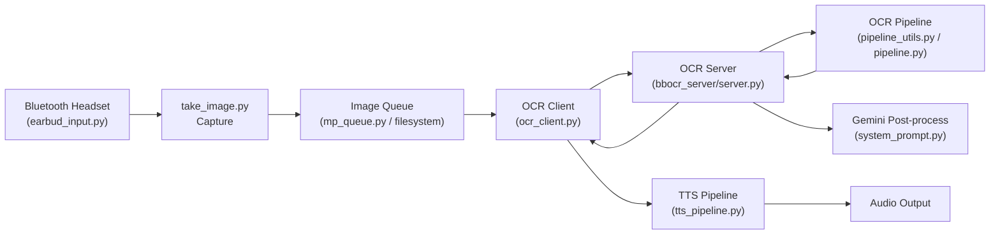

Supporting libraries (e.g., `common.py`, `bbocr_server/modules/…`) provide shared utilities, model download helpers, and abstract interfaces to keep components decoupled.

---

## 2. Device Interaction Suite

### 2.1 `earbud_input.py`

Listens to Bluetooth headset media buttons via `evdev` so a wearer can trigger image capture or queue management.

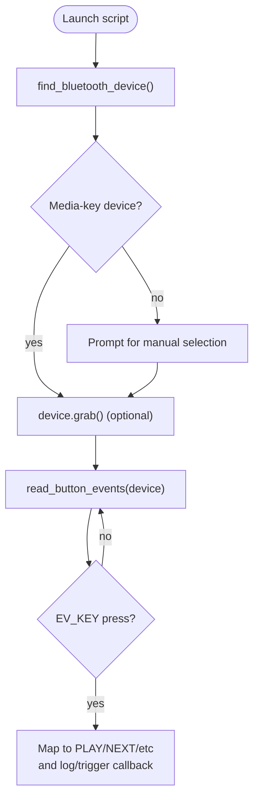

Key points:

- Prints recognised media keys; extend the mapping to enqueue jobs or call REST endpoints.
- Grabbing the device prevents other apps from receiving events; disable if coexistence is needed.
- Suggestion: wire button handlers to call `take_image.py` or push paths via `mp_queue.py`.

### 2.2 `take_image.py`

Captures still frames with Picamera2, applying autofocus hinting before storage.

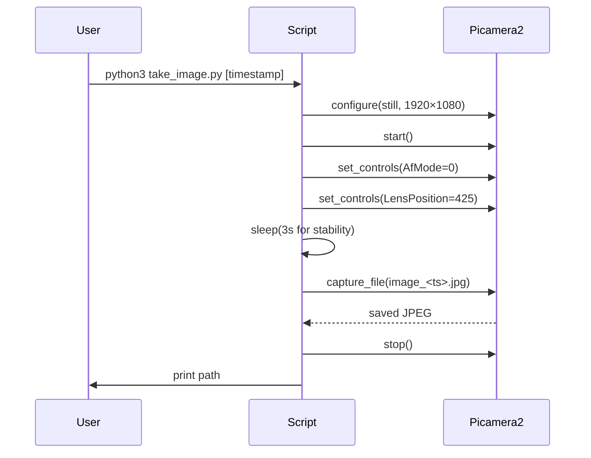

- Override timestamp via CLI or let the script auto-generate one.
- Integrate with the queue by adding a post-capture call to the OCR client’s enqueue helper.

### 2.3 `common.py`

Shared utility for PID-file bookkeeping and basic tagged logging.

| Class    | Purpose                                                                                       |
| -------- | --------------------------------------------------------------------------------------------- |
| `IPC`    | Creates `.pid/<name>.pid`, ensures singleton behaviour, and exposes `read_pid`/`send_signal`. |
| `Logger` | Minimal wrapper around `logging.basicConfig` to streamline CLI logging.                       |

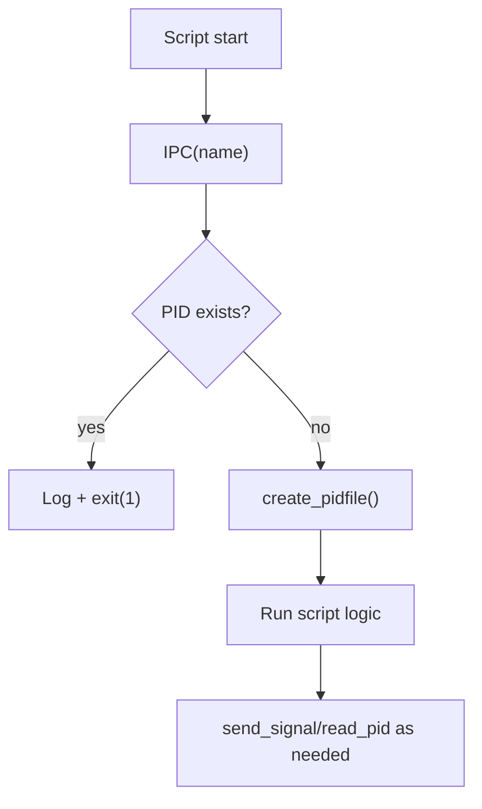

- PID files reside under `.pid/` relative to the CWD; align service runs with that assumption.
- Only uses standard library modules, keeping footprint tiny.

---

## 3. Queuing & Interprocess Communication

### `bbocr_server/mp_queue.py`

Exposes a `multiprocessing.Queue` over a manager server so separate processes can enqueue filenames.

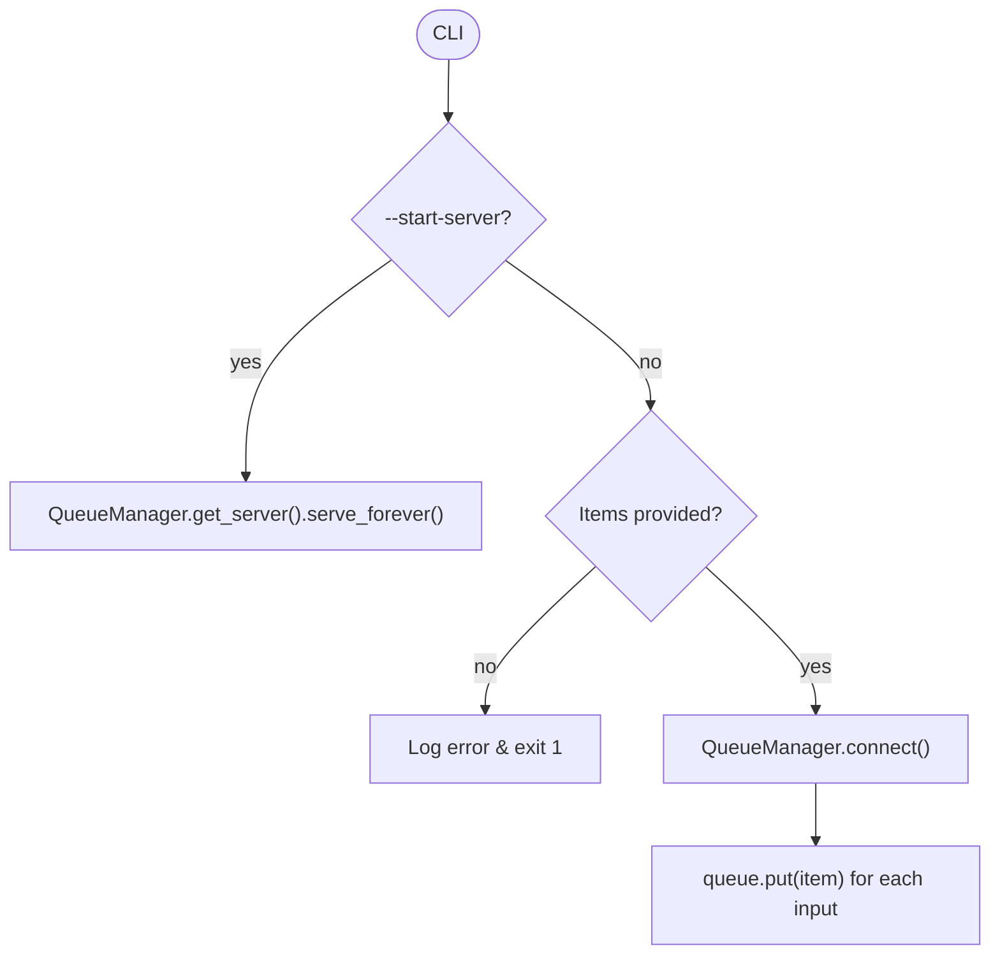

CLI samples:

- `python3 mp_queue.py --start-server`
- `python3 mp_queue.py img1.jpg img2.jpg`

Use this when capture scripts run in separate processes or machines but need to feed the main OCR client pipeline.

---

## 4. Client Runtime (Embedded Device)

### 4.1 `ocr_client.py`

Central controller on the embedded device. It dequeues image paths, authenticates against the server, uploads images, and voices results.

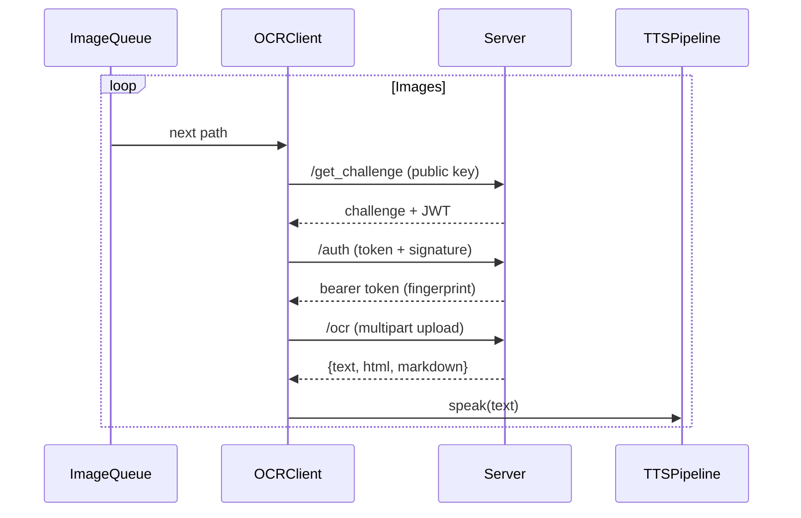

Core building blocks:

| Component    | Description                                                                                       |
| ------------ | ------------------------------------------------------------------------------------------------- |
| `Config`     | Aggregates env vars/CLI flags: queue backend choice, key paths, server URL, logging, TTS options. |
| `KeyManager` | Generates or loads RSA keys, signs challenges, stores server public key.                          |
| `ImageQueue` | Chooses between POSIX message queue or filesystem directory backend.                              |
| `TTSSink`    | Launches `tts_pipeline.py`, writes recognised text to its stdin, restarts on failure.             |

Operational notes:

- Maintains bearer tokens, refreshing automatically before expiry.
- Accepts CLI utilities like `--enqueue`, `--process-image`, and `--no-tts`.
- Logs queue read and upload issues, backing off per `retry_delay`.

### 4.2 `tts_pipeline.py`

Provides speech output for recognised text, with optional Bluetooth headset auto-connect.

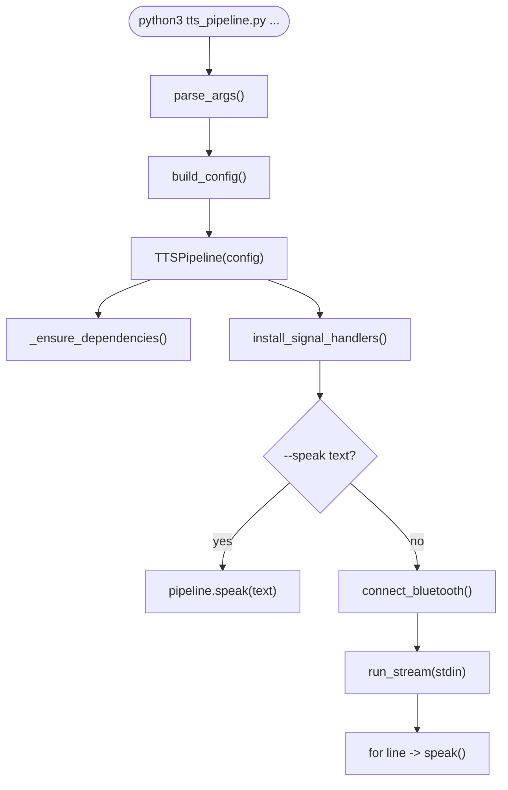

- Supports direct `espeak-ng` playback or piping audio through ALSA (`aplay`) when a specific device is set.
- Gracefully handles SIGINT/SIGTERM, flushing remaining text before exit.
- Provides environment variables (`TTS_VOICE`, `TTS_RATE`, `TTS_BLUETOOTH_MAC`, etc.) for quick tuning.

---

## 5. Server Runtime

### 5.1 `bbocr_server/server.py`

Flask application that authenticates devices, queues OCR jobs, invokes the pipeline, and optionally calls Gemini to polish text.

#### Architectural pieces

| Component          | Role                                                                                              |
| ------------------ | ------------------------------------------------------------------------------------------------- |
| `ServerConfig`     | Loads environment configuration for Mongo, keys, JWTs, queue timeouts, Gemini keys, etc.          |
| `ServerKeyManager` | Ensures RSA key pair is present and exposes PEM strings.                                          |
| `DeviceRepository` | Looks up authorised public keys via MongoDB or fallback JSON/PEM files (`authorized_keys`).       |
| `AuthService`      | Issues challenges, verifies signatures, mints bearer tokens keyed by public-key fingerprint.      |
| `OCRPipeline`      | Runs a background worker with multiprocessing queues, calling `pipeline_utils.render_image_html`. |
| `GeminiClient`     | Submits HTML to Gemini for Bangla proofreading, using `system_prompt.py`.                         |

#### Authentication flow

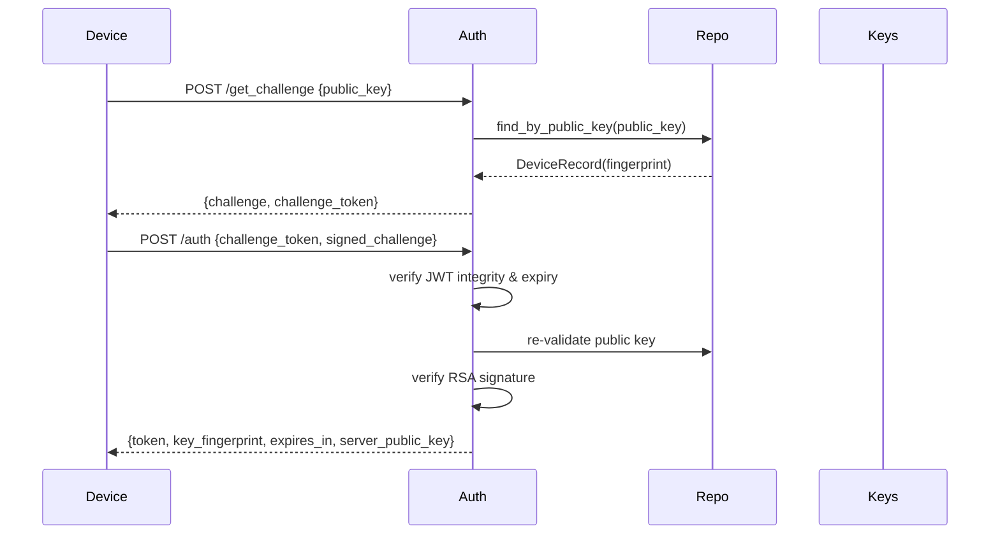

Tokens carry `key_fingerprint` rather than legacy device IDs, letting key rotation drive identity.

#### OCR request handling

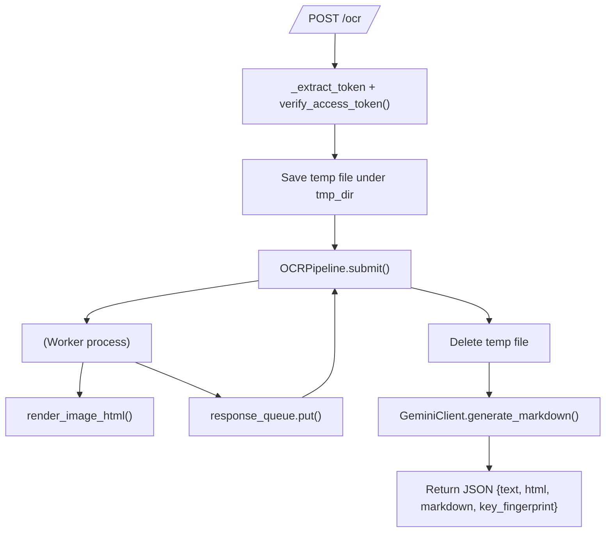

Deployment guidelines:

- Supply PEM files for each allowed device under `authorized_keys/` or JSON fallback.
- Set a strong `JWT_SECRET` and configure optionally for MongoDB lookups.
- Gemini integration is optional; when disabled the server still returns HTML/text.

### 5.2 `bbocr_server/pipeline_utils.py`

Facade over the heavyweight OCR pipeline, guaranteeing HTML output even when dependencies are missing.

- Checks if `pipeline.py` (full stack) is available; if not, falls back to Tesseract.
- `_escape_and_wrap` sanitises results and wraps them in HTML tags.
- `BB_OCR_LANG` environment variable defaults to `ben+eng` for fallback language hints.

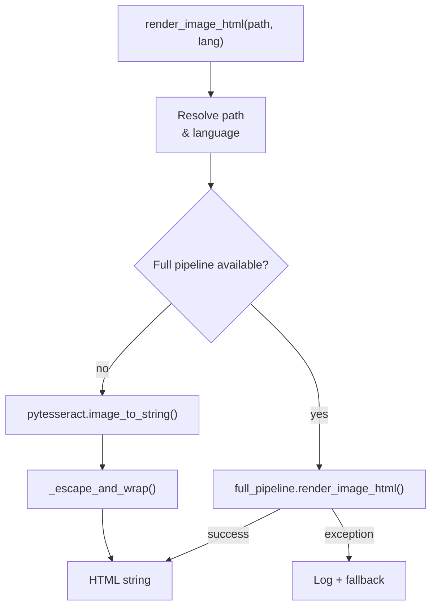

### 5.3 `bbocr_server/pipeline.py`

The full OCR workflow coupling YOLO layout analysis, Paddle DBNet detection, and ApsisNet recognition.

| Stage          | Key Functions                                                                                                        |
| -------------- | -------------------------------------------------------------------------------------------------------------------- |
| Configuration  | `parse_arguments`, `build_option`                                                                                    |
| Model loading  | `load_yolo`, `load_model`, `load_model2`, `load_bocr`                                                                |
| Pre-processing | `padWordImage`, `correctPadding`, `word_horizontal_dilation`, `line_horizontal_dilation`, `line_vertical_dilation`   |
| Detection      | `dla_predict`, `run_yolo_model`, `crop_all_text_box`, `single_image_layout`                                          |
| Recognition    | `recognize_word`, `word_predict`, `word_batch_predict`                                                               |
| Reconstruction | `generate_html`, `reconstruct`, `merge_image_arrays`, plus numerous `viz_*` helpers for debugging graphical overlays |

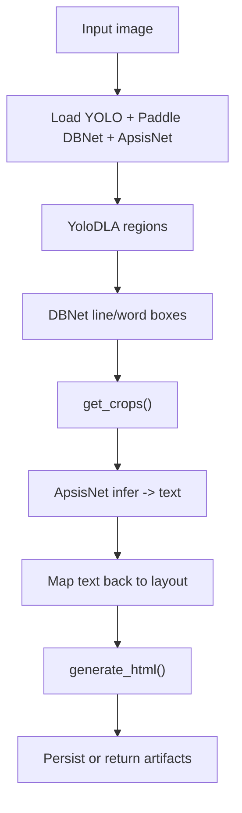

Outputs include pickled ROI datasets, word-level boxes, and HTML/Markdown reconstructions. These artifacts aid debugging and allow incremental processing.

### 5.4 `bbocr_server/system_prompt.py`

Defines the Bangla proofreading prompt used when invoking Gemini. It emphasises:

- correcting spelling, grammar, punctuation,
- preserving Bangla phrasing,
- avoiding translation into other languages.

### 5.5 `bbocr_server/server_pipeline.py` (Concept Stage)

Sketches an alternative server that would:

- authenticate clients,
- push jobs into Redis,
- call `pipeline.py`,
- send results through a Gemini API.

The implementation currently consists of constants/imports and a docstring describing the intended flow.

---

## 6. OCR Model Modules (`bbocr_server/modules/…`)

These Python packages encapsulate model interfaces and shared utilities used by both the full and fallback OCR pipelines.

### 6.1 Abstract Interfaces – `modules.py`

Defines contracts for detectors, recognisers, and layout analysers.

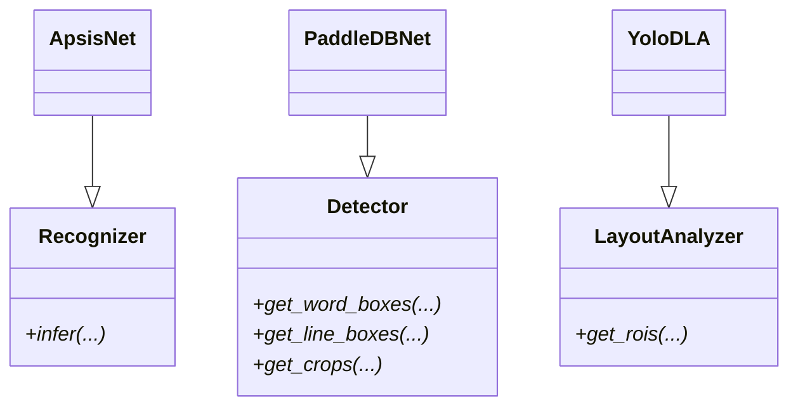

Implementations must provide these methods so the pipeline can swap models without refactoring.

### 6.2 Utility Helpers – `utils.py`

Shared helpers for logging, directory preparation, and Google Drive downloads.

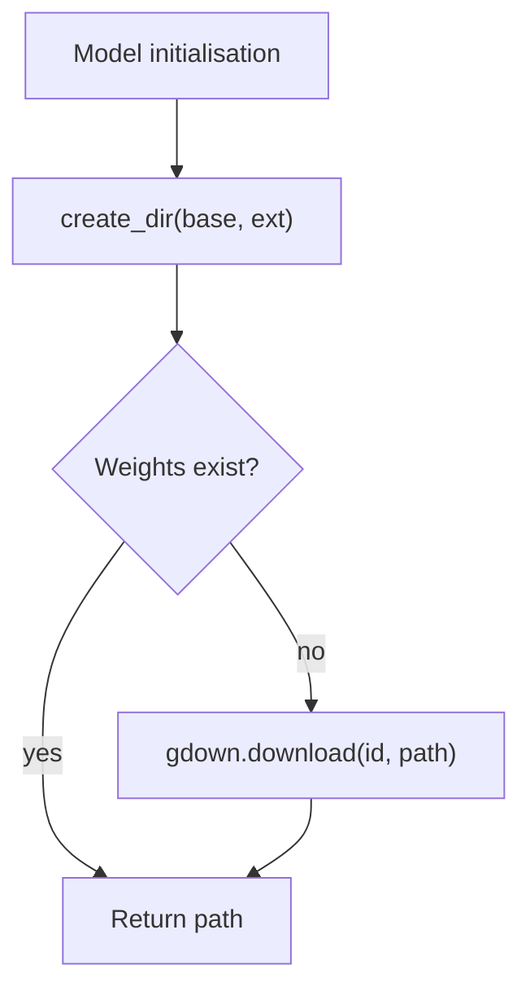

- `LOG_INFO`: coloured console logging.
- `create_dir`: ensures model directories exist (`~/.bengali_ai_ocr/...`).
- `download`: fetches files via `gdown`.
- `dotdict`: attribute-style dictionary access for convenience.

### 6.3 ApsisNet Recogniser – `apsisnet.py`

ONNX-based Bangla word recogniser with optional Unicode normalisation.

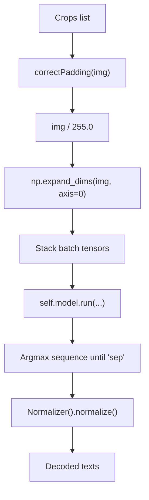

- Downloads ONNX weights into `~/.bengali_ai_ocr/bnocr.onnx` if missing.
- Vocabulary includes Bangla characters plus special tokens (`blank`, `sep`, `pad`).
- Batch size auto-adjusts based on available crops.

### 6.4 Paddle DBNet Detector – `paddledbnet.py`

Detects text lines and words using PaddleOCR. Handles model downloads, GPU setup, and crop extraction.

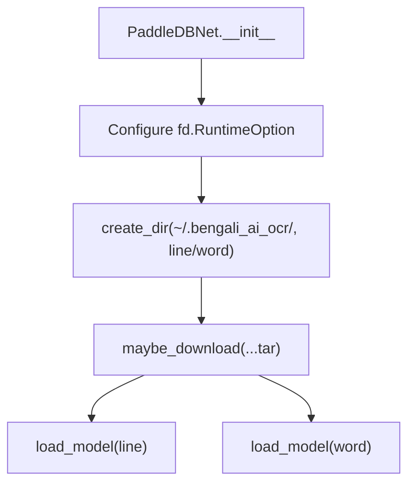

Key features:

- Configurable thresholds (`det_db_thresh`, `det_db_box_thresh`, etc.).
- Extracts rotated crops using perspective transforms.
- Supports GPU acceleration via FastDeploy.

### 6.5 YOLO Layout Analyzer – `yolodla.py`

Ultralytics YOLO model that segments document structure (paragraphs, tables, images, etc.).

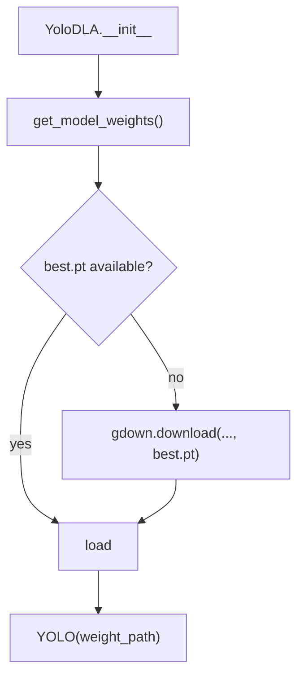

- Returns normalised coordinates and metadata for each detected region to guide cropping and recognition.
- Currently carries a local definition of `LayoutAnalyzer` for quick testing; align with `modules.py` for production use.

### 6.6 Module Initialiser – `__init__ .py`

Empty placeholder ensuring `bbocr_server/modules/` behaves as a package. The filename contains a stray space (`__init__ .py`); rename to `__init__.py` for tooling compatibility.

---

## 7. Future Considerations & Tips

- **Key Management**: Maintain PEM files for each device in `bbocr_server/authorized_keys`, and rotate keys by fingerprint rather than device IDs.
- **Queue Choices**: POSIX queues offer low latency; filesystem queues are useful for portability or debugging. `mp_queue.py` bridges remote producers.
- **Monitoring**: Use logs from `ocr_client`, server, and TTS modules to detect fallback scenarios (e.g., Gemini disabled, pipeline fallback to Tesseract).
- **Extensibility**: Implement new recognisers/detectors with the ABCs in `modules.py`, then plug them into `pipeline.py` or `pipeline_utils.py`.
- **Documentation**: This unified guide replaces individual markdown files; update it when components evolve to keep architectural knowledge centralised.
