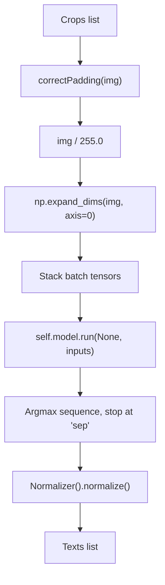

# `bbocr_server/modules/apsisnet.py` Reference

## Overview

Implements the `ApsisNet` Bangla OCR recogniser on top of ONNX Runtime. It converts word-level image crops into Unicode text, including optional normalisation via `bnunicodenormalizer`.

## Dependencies

- `onnxruntime` for inference.
- `numpy`, `cv2` for image manipulation.
- `bnunicodenormalizer.Normalizer` to clean Bangla Unicode output.
- `Recognizer` ABC from `modules.py`.
- Utility downloader from `utils.py`.

## Class Structure

| Member                                                | Description                                                                                                                                |
| ----------------------------------------------------- | ------------------------------------------------------------------------------------------------------------------------------------------ |
| Constructor (`__init__`)                              | Configures input dimensions, downloads the ONNX model (if missing), loads weights into `ort.InferenceSession`, and defines the vocabulary. |
| `get_model_weights()`                                 | Saves weights in `~/.bengali_ai_ocr/bnocr.onnx`, downloading via Google Drive if absent.                                                   |
| `process_batch(crops)`                                | Pads and normalises crops, assembles batch tensors (`image`, `pos`).                                                                       |
| `infer(crops, batch_size=32, normalize_unicode=True)` | Runs inference in batches, decodes logits into strings, and optionally normalises Unicode sequences.                                       |

### Vocabulary

`self.vocab` contains Bangla characters, digits, punctuation, control tokens (`blank`, `sep`, `pad`), enabling the CTC-style decoding loop.

## Word Pre-processing

## Helper Functions

| Function                                       | Role                                                                                   |
| ---------------------------------------------- | -------------------------------------------------------------------------------------- |
| `padWordImage(img, pad_loc, pad_dim, pad_val)` | Adds padding horizontally or vertically to achieve model dimensions.                   |
| `correctPadding(img, dim, pvalue=255)`         | Resizes and pads input images to `img_height×img_width` while preserving aspect ratio. |

## Interactions

- Consumed by `bbocr_server/pipeline.py` when performing recognition on crops extracted by detectors.
- Integrates with `Normalizer` to ensure consistent Bangla Unicode output before downstream formatting (e.g., in `pipeline_utils.render_image_html`).

## Performance Considerations

- Batch inference is adaptive: `batch_size` caps the number of crops processed per run, automatically reduced if fewer crops remain.
- Unicode normalisation is optional; disable `normalize_unicode` if raw model output is required.
