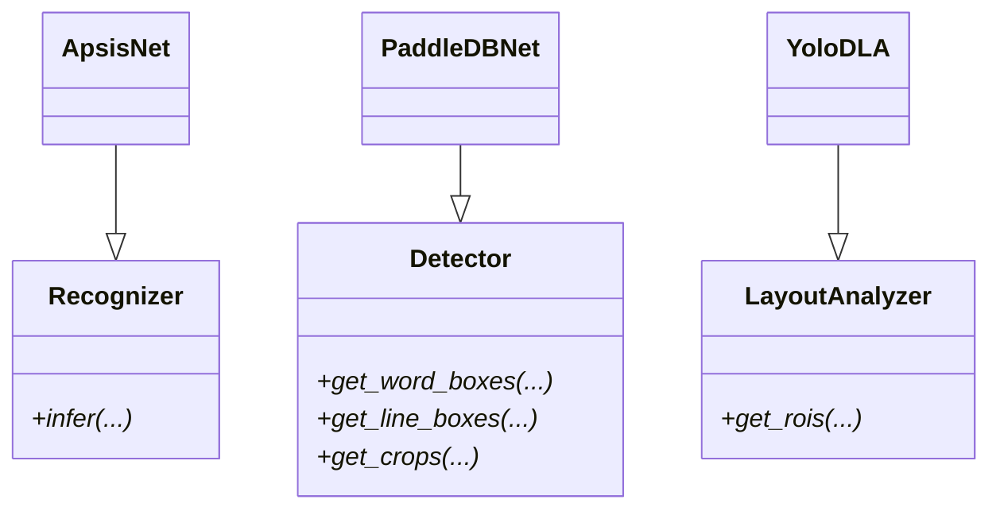

# `bbocr_server/modules/modules.py` Reference

## Overview

This module defines abstract base classes that describe the interfaces for OCR components:

- `Recognizer`: Converts cropped text images into strings.
- `Detector`: Finds line/word bounding boxes and returns cropped regions.
- `LayoutAnalyzer`: Identifies higher-level layout regions (paragraphs, tables, images).

Concrete implementations (e.g., `ApsisNet`, `PaddleDBNet`, `YoloDLA`) inherit from these ABCs to guarantee consistent APIs across the pipeline.

## Class Contracts

| Class            | Abstract Methods                                      | Intended Implementations                                     |
| ---------------- | ----------------------------------------------------- | ------------------------------------------------------------ |
| `Recognizer`     | `infer(self, ...)`                                    | See `ApsisNet.infer` for ONNX-based Bangla text recognition. |
| `Detector`       | `get_word_boxes()`, `get_line_boxes()`, `get_crops()` | Implemented by `PaddleDBNet` using Paddle OCR detectors.     |
| `LayoutAnalyzer` | `get_rois()`                                          | Implemented by `YoloDLA` to detect key document regions.     |

## Mermaid Overview

## Integration

- `bbocr_server/pipeline.py` and `pipeline_utils.py` expect detector/recogniser instances to adhere to these interfaces.
- The abstract base classes make it easier to swap models (e.g., using a different recogniser) without changing downstream pipeline code.

## Extension Tips

- When creating new recognisers or detectors, inherit from the relevant ABC to benefit from static analysis and to document required methods clearly.
- If you need additional hooks (e.g., batch-wise stats), extend the ABCs with optional methods and update existing implementations accordingly.
