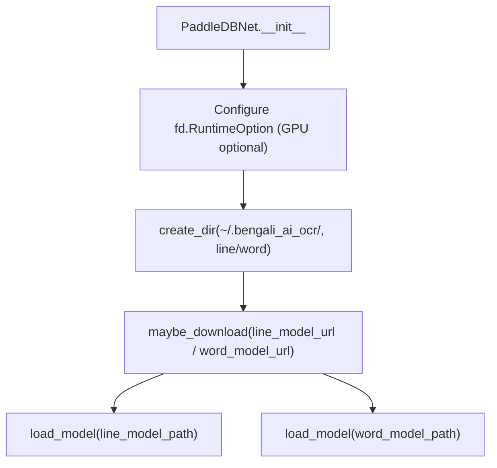

# `bbocr_server/modules/paddledbnet.py` Reference

## Overview

Provides a PaddleOCR-based detector (`PaddleDBNet`) that finds line and word bounding boxes in documents. It handles model download, GPU configuration, inference, and crop extraction compatible with the broader OCR pipeline.

## Dependencies

- `fastdeploy` vision OCR runtime (`fd.vision.ocr.DBDetector`).
- `opencv-python` (`cv2`) for image warping.
- `numpy`, `copy`.
- `requests`, `tarfile`, `tqdm` for downloading model archives.
- Local helpers `LOG_INFO`/`create_dir`/`download` from `utils.py`.

## Initialisation Flow

## Key Methods

| Method                               | Description                                                                                               |
| ------------------------------------ | --------------------------------------------------------------------------------------------------------- |
| `load_model(path)`                   | Loads Paddle inference files into a `DBDetector`, applying preprocessing and post-processing parameters.  |
| `get_word_boxes(image)`              | Runs the word-level detector, returning bounding boxes.                                                   |
| `get_line_boxes(image)`              | Runs the line-level detector.                                                                             |
| `get_crops(img, boxes)`              | Extracts rotated crops for each quadrilateral box using perspective transforms (`get_rotate_crop_image`). |
| `get_rotate_crop_image(img, points)` | Warps quadrilateral coordinates into upright rectangles, rotating if aspect ratio is tall.                |

## Download Helpers

- `maybe_download` fetches `.tar` archives and extracts `inference.pdmodel/pdiparams`.
- `download_with_progressbar` streams with progress feedback via `tqdm`.

## Interaction Points

- Feeds crops into recognisers such as `ApsisNet` (`modules/apsisnet.py`).
- Coordinates with layout detectors (`YoloDLA`) in `pipeline.py` to combine line/word detection with page segmentation.

## Configuration Parameters

| Parameter                             | Default            | Effect                                                                                      |
| ------------------------------------- | ------------------ | ------------------------------------------------------------------------------------------- |
| `use_gpu`                             | `True`             | Enables CUDA via `fd.RuntimeOption.use_gpu(device_id)`; set `False` for CPU-only inference. |
| `max_side_len`                        | `960`              | Maximum dimension for resized inputs.                                                       |
| `det_db_thresh` / `det_db_box_thresh` | `0.3` / `0.6`      | Post-processing thresholds controlling DBNet filtering.                                     |
| `det_db_unclip_ratio`                 | `1.5`              | Expands bounding boxes to catch full text.                                                  |
| `line_model_url` / `word_model_url`   | PaddleOCR tarballs | Location of detection weights.                                                              |

## Considerations

- Ensure CUDA and Paddle dependencies are installed if `use_gpu=True`.
- Downloaded models live under `~/.bengali_ai_ocr/(line|word)`; delete to force re-downloads.
- `get_crops` returns raw BGR images; downstream recognisers should convert or normalise as needed.
