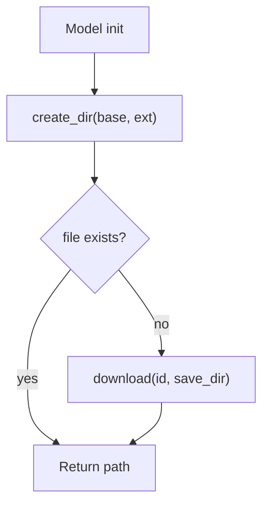

# `bbocr_server/modules/utils.py` Reference

## Overview

Helper utilities supporting the Bangla OCR modules:

- Console logging with colour (`LOG_INFO`).
- Directory creation wrappers (`create_dir`).
- Download helper using `gdown`.
- `dotdict` convenience type.

These utilities are shared across detector/recogniser implementations, especially those that fetch pretrained weights.

## Functions

| Function                       | Description                                                                   | Usage                                                                |
| ------------------------------ | ----------------------------------------------------------------------------- | -------------------------------------------------------------------- |
| `LOG_INFO(msg, mcolor='blue')` | Prints coloured messages with a `#LOG` prefix for better console readability. | Called by `paddledbnet.py` during downloads.                         |
| `create_dir(base, ext)`        | Ensures a sub-directory exists and returns its path.                          | Used to prepare model directories (`~/.bengali_ai_ocr/<line/word>`). |
| `download(id, save_dir)`       | Leverages `gdown` to download Google Drive files by file ID.                  | Used by `apsisnet.py` and optionally other components.               |

## Classes

| Class     | Purpose                                                         |
| --------- | --------------------------------------------------------------- |
| `dotdict` | Subclass of `dict` enabling attribute-style access (`obj.key`). |

## Flow Snapshot

## Dependencies

- External: `termcolor`, `gdown`.
- Standard library: `os`.

## Integration

- `PaddleDBNet` uses `LOG_INFO` for status updates and `create_dir`/`download` to manage detection models.
- `ApsisNet` imports `download` to obtain ONNX weights.

## Considerations

- `download` assumes an accessible Google Drive file ID; ensure shared links remain valid.
- For headless environments, consider adding retries or checksums to verify downloads.
