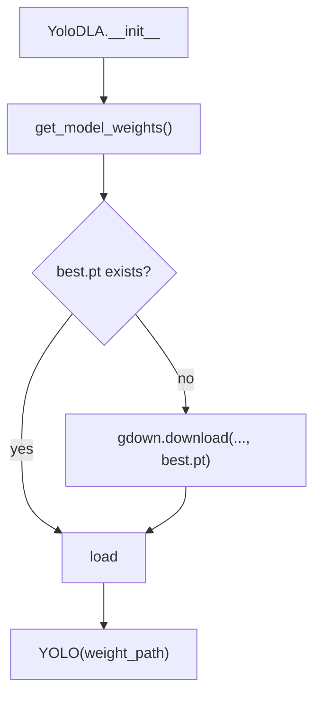

# `bbocr_server/modules/yolodla.py` Reference

## Overview

Implements `YoloDLA`, a layout analysis model built on Ultralytics YOLO. It segments documents into regions (paragraphs, text boxes, images, tables) to support downstream OCR workflows.

## Dependencies

- `ultralytics.YOLO` for inference.
- `gdown` to download pretrained weights from Google Drive.
- `math`/`Path` for coordinate conversions and filesystem management.

## Initialisation

## Methods

| Method                                   | Description                                                                                                                   |
| ---------------------------------------- | ----------------------------------------------------------------------------------------------------------------------------- |
| `get_model_weights()`                    | Stores weights in `~/.bengali_ai_ocr/best.pt`, downloading when necessary.                                                    |
| `get_yolo_prediction(image)`             | Runs YOLO inference and returns `ultralytics.yolo.engine.results.Results`.                                                    |
| `get_normalized_coordinates(xyxy, h, w)` | Converts pixel bounding boxes to `[0,1]` coordinates.                                                                         |
| `get_original_coordinates(coords, W, H)` | Reverts normalised coordinates back to pixel units.                                                                           |
| `get_rois(image)`                        | Iterates over YOLO detections, building dictionaries that include class labels, normalised positions, and dimension metadata. |

## Output Format

Each region-of-interest dictionary includes:

- `class`: Human-readable class name (`paragraph`, `text_box`, `image`, `table`).
- `coordinates`: Normalised `[x_min, y_min, x_max, y_max]`.
- `left`/`top`: Percent-based positions (0–100).
- `elem_width`/`elem_height`: Percent spans.
- `img_height`/`img_width`: Original image dimensions.
- `text`, `single-line`, `img_src`: Placeholders for downstream enrichment.

## Integration

- Works alongside `PaddleDBNet` to focus detection efforts on text-dense regions.
- Provides structural hints to `bbocr_server/pipeline.py` when reconstructing HTML layouts.

## Considerations

- The module currently redefines a minimal `LayoutAnalyzer` ABC (for debugging). In a production codebase, replace with the version from `modules/modules.py`.
- YOLO models require GPU acceleration for best performance but can run on CPU for testing.
- Extend `names` mapping to match dataset label indices if retraining the model.
