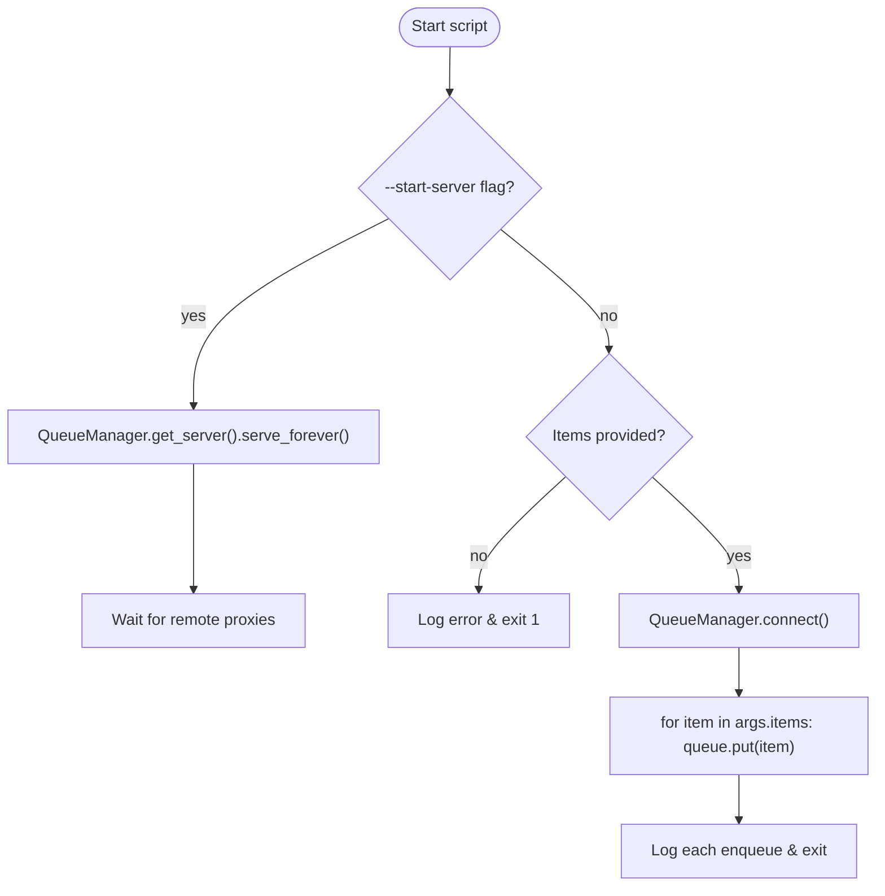

# `bbocr_server/mp_queue.py` Reference

## Overview

`mp_queue.py` provides a small command-line utility for sharing a `multiprocessing.Queue` between processes. It can either:

1. Run as a manager server exposing a queue proxy.
2. Act as a client to enqueue filenames (e.g., image paths) into the shared queue.

This is useful when multiple producers/consumers need to coordinate outside of the main Flask server.

## Operation Modes

## CLI Usage

| Example                                                                               | Description                                                         |
| ------------------------------------------------------------------------------------- | ------------------------------------------------------------------- |
| `python3 bbocr_server/mp_queue.py --start-server`                                     | Launch the manager server on `127.0.0.1:50000` with auth key `abc`. |
| `python3 bbocr_server/mp_queue.py img1.jpg img2.jpg`                                  | Connect to the server and enqueue two items.                        |
| `python3 bbocr_server/mp_queue.py --host 0.0.0.0 --port 50010 --authkey secret item1` | Custom bind address and authentication key.                         |

## Key Elements

| Symbol                                   | Description                                            |
| ---------------------------------------- | ------------------------------------------------------ |
| `QueueManager`                           | Subclass of `BaseManager` registering `get_queue`.     |
| `_queue_factory()`                       | Lazily constructs the backing `multiprocessing.Queue`. |
| `start_server(address, authkey)`         | Starts the manager server (blocking).                  |
| `enqueue_items(address, authkey, items)` | Client helper to connect and push items.               |
| `parse_args()` / `main()`                | CLI plumbing with logging and error reporting.         |

## Interactions

- Can be used by `bbocr_server/server.py` to decouple image ingestion from processing, although the server currently uses in-process queues.
- Works with any Python process able to obtain a proxy via `QueueManager(address, authkey)`.

## Error Handling

- Connection failures (e.g., server absent) produce a clear log, advising to start the server.
- Terminal exit codes: `1` for invalid usage, `2` for connection errors.

## Extension Ideas

- Add a `--drain` command to pop items for debugging.
- Support TLS or Unix-domain sockets by adjusting the `address` parameter (e.g., using `("localhost", port)` vs. a file path on Unix).
