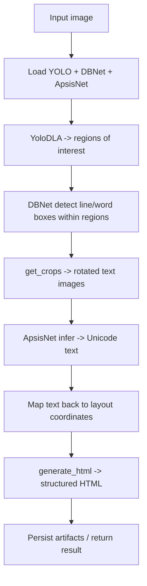

# `bbocr_server/pipeline.py` Reference

## Overview

This module contains the full-featured Bangla OCR pipeline combining layout detection, text detection, recognition, and HTML reconstruction. It orchestrates Ultralytics YOLO, PaddleOCR detectors, and an ONNX recogniser to rebuild document structure and text content. A lightweight fallback (`pipeline_utils.py`) wraps selected functions when the full stack is unavailable.

## Key Responsibilities

| Stage          | Description                                                                                           | Primary Functions                                                                                                  |
| -------------- | ----------------------------------------------------------------------------------------------------- | ------------------------------------------------------------------------------------------------------------------ |
| Configuration  | Parse CLI arguments, resolve model paths, configure runtime options (CPU/GPU).                        | `parse_arguments`, `build_option`                                                                                  |
| Model Loading  | Lazily load YOLO (`best.pt`), Paddle DBNet detectors, and Bangla OCR recogniser.                      | `load_yolo`, `load_model`, `load_model2`, `load_bocr`                                                              |
| Pre-processing | Pad and normalise crops, apply morphological adjustments to detection boxes.                          | `padWordImage`, `correctPadding`, `word_horizontal_dilation`, `line_horizontal_dilation`, `line_vertical_dilation` |
| Detection      | Run YOLO for layout (`yolo`/`run_yolo_model`), Paddle DBNet for word/line boxes, layout segmentation. | `dla_predict`, `crop_all_text_box`, `single_image_layout`                                                          |
| Recognition    | Convert cropped word images into text sequences.                                                      | `recognize_word`, `word_predict`, `word_batch_predict`                                                             |
| Reconstruction | Merge detections, map coordinates, assemble HTML and intermediate pickles.                            | `generate_html`, `reconstruct`, `merge_image_arrays`                                                               |

## High-Level Workflow

## Important Functions

| Function                                                            | Summary                                                                                                 |
| ------------------------------------------------------------------- | ------------------------------------------------------------------------------------------------------- |
| `single_image_layout(model_weight, image_path, config_yml)`         | Runs layout analysis for a single image using YOLO and configuration files.                             |
| `generate_html(detected_elements_info, file_name)`                  | Produces HTML output (and optionally WORD/paragraph metadata) grounded on detected elements.            |
| `reconstruct(directory, img_src_save_dir, standalone_OCR_required)` | Master routine that calls detection, recognition, and HTML generation for each image in a directory.    |
| `viz_*` helpers                                                     | Provide visual debugging for detection/recognition outputs by drawing bounding boxes and saving images. |

## Data Artifacts

- Pickle files stored under `data/` (`*_word_boxes.pkl`, `*_recognized_text.pkl`, etc.) capture intermediate states for debugging or incremental processing.
- Region-of-interest (ROI) and word-level metadata are persisted to facilitate manual inspection or downstream tasks.

## Interactions

- Imports local modules from `bbocr_server/modules/`:
  - `PaddleDBNet` for detection,
  - `ApsisNet` for recognition,
  - `YoloDLA` for layout analysis.
- Serves as the heavyweight engine when `pipeline_utils` detects that `HAS_FULL_PIPELINE` is `True`.
- Designed to run as a standalone script (CLI) or as part of batch processing via the `reconstruct` routine.

## Configuration Notes

- Hard-coded defaults point to models under `~/.bengali_ai_ocr/` and PaddleOCR installation directories; adjust when porting to new systems.
- GPU usage is optional but recommended; set `--device gpu` and point to the correct Paddle models.
- Global switches (e.g., `LOG_ALL`) control verbose logging and debug image dumps.

## Extending the Pipeline

| Extension              | Guidance                                                                                                   |
| ---------------------- | ---------------------------------------------------------------------------------------------------------- |
| Swap recogniser        | Implement the `Recognizer` interface, adjust `load_bocr` / `recognize_word` to instantiate it.             |
| Add language packs     | Modify vocabulary and normalisation routines to support multi-language recognition.                        |
| Export structured data | Extend `generate_html` to output JSON outlining bounding boxes + text for integration with other services. |
