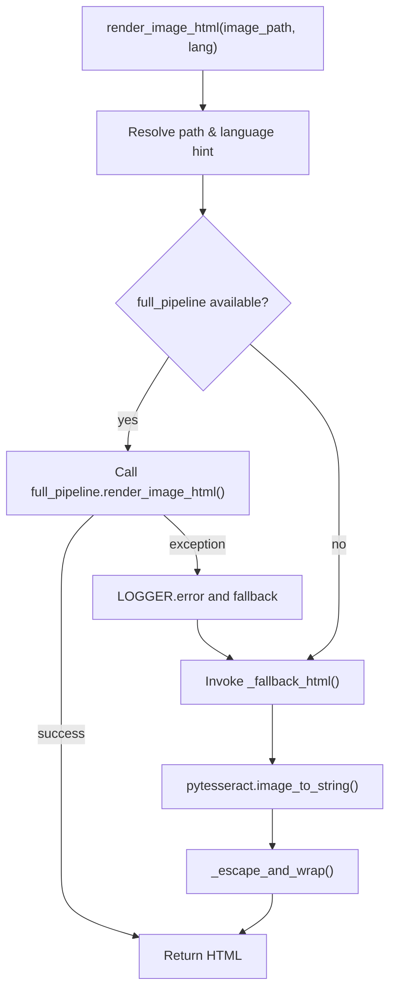

# `bbocr_server/pipeline_utils.py` Reference

## Overview

`pipeline_utils.py` wraps the heavyweight OCR stack provided by `pipeline.py` and offers a simplified API, `render_image_html`, that always returns HTML output. If the full pipeline (YOLO + Paddle + ONNX) is unavailable, it falls back to a lightweight `pytesseract` implementation.

## Execution Flow

## Helper Functions

| Function                                   | Description                                                                                                                                       |
| ------------------------------------------ | ------------------------------------------------------------------------------------------------------------------------------------------------- |
| `_escape_and_wrap(text)`                   | HTML-escapes text, normalises newlines, and wraps it inside `<html><body>
` tags with ` ` breaks.                                           |
| `_fallback_html(image_path, lang)`         | Opens the image via Pillow and runs `pytesseract.image_to_string`, then passes the result to `_escape_and_wrap`.                                  |
| `render_image_html(image_path, lang=None)` | Public API: resolves the path, determines language (`BB_OCR_LANG` default `ben+eng`), attempts full pipeline, and falls back to `_fallback_html`. |

## Interactions

- **Full pipeline**: Attempts to import `.pipeline` (which defines `HAS_FULL_PIPELINE` and optional `render_image_html`). If present, the heavyweight OCR pipeline is used transparently.
- **Server**: `bbocr_server/server.py` uses `render_image_html` inside `_perform_ocr`.
- **Environment Variables**: `BB_OCR_LANG` selects the fallback language hint for Tesseract.

## Dependencies

- `PIL.Image` for image loading.
- `pytesseract` for fallback OCR.
- Optional: `.pipeline` module and its dependencies (`layoutparser`, `fastdeploy`, etc.).

## Extension Tips

- To integrate additional fallback languages, allow `lang` parameter to be a list and loop through them until non-empty output is produced.
- You can expose intermediate results (e.g., detection bounding boxes) by extending the `render_image_html` signature to return structured data when the full pipeline is active.
