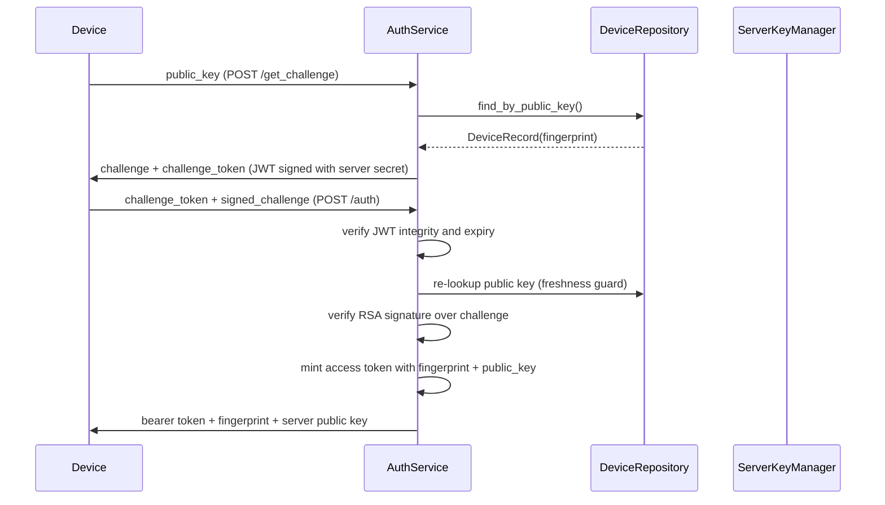

# `bbocr_server/server.py` Reference

## Overview

`server.py` hosts the Flask-based Bangla OCR backend. It authenticates devices via public-key challenge/response, queues image processing work, invokes the OCR pipeline, and optionally asks Gemini to post-process results. The module is structured to run as a long-lived service with graceful shutdown.

## Architectural Components

| Component           | Purpose                                                                                                         | Key Dependencies                       |
| ------------------- | --------------------------------------------------------------------------------------------------------------- | -------------------------------------- |
| `ServerConfig`      | Reads environment variables for MongoDB, key storage, JWT settings, queue timeout, Gemini config, etc.          | `os`, `Path`                           |
| `ServerKeyManager`  | Ensures server RSA key pair exists, loads PEM material for signing/verifying.                                   | `cryptography.hazmat`                  |
| `DeviceRepository`  | Resolves authorised devices either from MongoDB, `authorized_devices.json`, or PEM files in `authorized_keys/`. | `pymongo` (optional), JSON, filesystem |
| `AuthService`       | Implements challenge issuance, signature verification, bearer token creation, and token validation.             | `jwt`, `hashlib`, `time`               |
| `OCRPipeline`       | Spawns a worker process with queues to offload OCR work via `pipeline_utils.render_image_html`.                 | `multiprocessing`, `pipeline_utils`    |
| `GeminiClient`      | Calls the Gemini API to convert OCR HTML to polished Markdown.                                                  | `requests`                             |
| `ServerApplication` | Wires configuration, authentication, pipeline, and Gemini client together.                                      | Internal classes                       |

## HTTP Surface

| Endpoint         | Method | Description                                                                                                             |
| ---------------- | ------ | ----------------------------------------------------------------------------------------------------------------------- |
| `/health`        | GET    | Lightweight uptime check returning `{status:"ok"}`.                                                                     |
| `/get_challenge` | POST   | Body `{public_key}` → returns a signed challenge JWT and key fingerprint.                                               |
| `/auth`          | POST   | Body `{challenge_token, signed_challenge}` → verifies signature and returns `{token, key_fingerprint, expires_in}`.     |
| `/ocr`           | POST   | Authenticated multipart/form-data with `file` field → enqueues image, waits for OCR result, returns text/HTML/Markdown. |

## Authentication Workflow



### Token Contents

- Challenge tokens include `public_key`, `fingerprint`, `challenge`, `iat`, and `exp`.
- Access tokens include `key_fingerprint`, `public_key`, `iat`, and `exp`.

## OCR Processing Flow

```mermaid
flowchart TD
    upload[POST /ocr] --> verifyToken[verify_access_token()]
    verifyToken --> saveTmp[Save upload into tmp_dir]
    saveTmp --> submit[OCRPipeline.submit()]
    submit --> worker[(OCR worker process)]
    worker --> utils[render_image_html()]
    utils --> worker
    worker --> responseQueue[response_queue.put()]
    responseQueue --> submit
    submit --> cleanup[Delete temp file]
    cleanup --> gemini[GeminiClient.generate_markdown()]
    gemini --> reply[Return JSON with text/html/markdown/refined_text + key_fingerprint]
```

## Device Repository Behaviour

- **MongoDB mode**: Attempts to connect once; if available, device lookups come from the `MONGO_CERT_COLLECTION`. Documents may use either `publicKey/public_key` and optional legacy `deviceId`.
- **Fallback mode**: Loads PEM entries from `authorized_devices.json` (storing legacy IDs in metadata) and any `.pem`/`.pub` files in `authorized_keys/`.
- Fingerprints are SHA-256 hashes of PEM strings and uniquely identify devices without managing explicit IDs.

## OCRPipeline Implementation

- Creates per-process `multiprocessing` context (`fork` by default) and spawns a worker running `_ocr_worker`.
- Jobs are dictionaries `{id, path}`; results include `{id, status, text, html}`.
- Maintains `_pending_results` mapping to deliver late responses if queue reads race.
- On shutdown, pushes a `{"type": "shutdown"}` sentinel, joins the worker, and terminates if necessary.

## Gemini Integration

- Optional: if `GEMINI_API_KEY` is missing, Markdown generation is skipped.
- Sends OCR HTML to Gemini with a Bangla proofreading system prompt (`system_prompt.py`).
- Converts Gemini Markdown to speech-friendly plain text (`refined_text`) for downstream TTS.
- `GEMINI_RETRIES`/`GEMINI_RETRY_DELAY` tune automatic retry behaviour when the API returns transient errors.

## Notable Interactions

- Uses `pipeline_utils.render_image_html` for fallback OCR to keep the server lightweight while still delegating to the heavy `pipeline.py` when available.
- Shares key material with client scripts via the `keys/` directory and fingerprint-based auth (mirrors `ocr_client.KeyManager`).
- `mp_queue.py` can replace or augment the internal queues if remote processes need to submit images.

## Deployment Hints

- Ensure `authorized_devices.json` or `AUTHORIZED_KEYS_DIR` contains the public keys (PEM) of allowed devices.
- Configure `JWT_SECRET` with a strong random value; tokens are symmetric HMAC.
- Provision Redis/Gemini credentials if using `server_pipeline.py`; however, this module is self-contained and does not require Redis.
- Monitor logs (`bbocr_server` logger) for fallback warnings (e.g., missing MongoDB or Gemini).
- `SERVER_PORT_AUTO` (default on) allows automatic fallback to the next available port when the requested port is busy; set it to `0` to disable.
