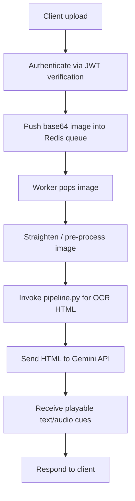

# `bbocr_server/server_pipeline.py` Reference

## Status

This module sketches an alternative HTTP server that leverages Redis for queuing and an external Gemini API, but it is currently incomplete (constants and imports only). The docstring captures the intended processing pipeline.

## Intended Workflow

## Planned Responsibilities

| Stage           | Description                                                                     | Dependencies                             |
| --------------- | ------------------------------------------------------------------------------- | ---------------------------------------- |
| Authentication  | Validate bearer tokens before accepting uploads.                                | `jwt`, Flask request headers             |
| Queuing         | Use Redis (`redis.Redis`) to buffer incoming jobs.                              | External Redis server                    |
| Image Handling  | Straighten / normalise incoming images prior to OCR.                            | `PIL.Image`, `BytesIO`, local filesystem |
| OCR             | Delegate to `bbocr_server/pipeline.py` (or `pipeline_utils.render_image_html`). | Subprocess invocation                    |
| Post-processing | Call Gemini API for Markdown or TTS-ready text.                                 | `requests`, Gemini API key               |
| Response        | Package final text/audio markers back to the HTTP client.                       | Flask response objects                   |

## Existing Code Elements

- Flask app initialisation (`app = Flask(__name__)`) with `flask_cors.CORS` enabled globally.
- Redis connection placeholder pointing at `localhost:6379`.
- Static JWT/Gemini configuration constants awaiting secure configuration.

## Integration Notes

- The finished pipeline would resemble the production-ready version in `bbocr_server/server.py`, but with Redis and external services decoupling ingestion from OCR.
- Consider reusing the auth + OCR pipeline classes from `server.py` to avoid duplication when completing this module.
