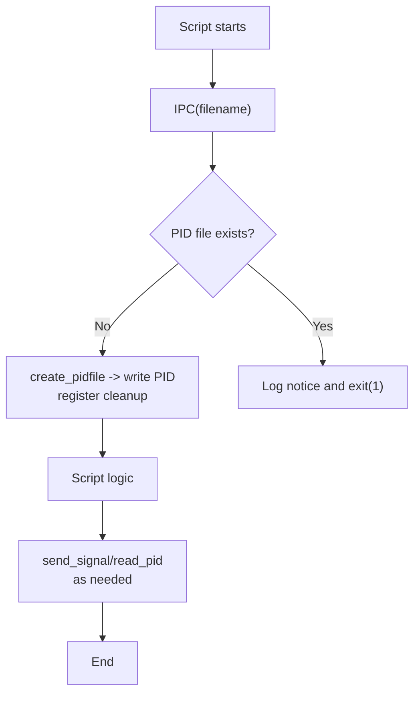

# `common.py` Reference

## Overview

`common.py` bundles lightweight inter-process coordination utilities used by other scripts in the repository. The module focuses on two concerns:

- Managing PID files so helper daemons can be signalled or prevented from running twice.
- Providing a trivial tagged logger wrapper for simple CLI scripts.

Both classes avoid external dependencies and rely on the current working directory for `.pid` bookkeeping.

## Components

| Name     | Type  | Description                                                                         |
| -------- | ----- | ----------------------------------------------------------------------------------- |
| `IPC`    | class | Creates and manages PID files, exposes helpers to read a PID and send Unix signals. |
| `Logger` | class | Thin wrapper around `logging.basicConfig` that prefixes messages with a tag.        |

## Workflow

1. An invoking script instantiates `IPC(filename)` to create `.pid/{filename}.pid`.
2. `IPC.create_pidfile` writes the current process ID and registers an `atexit` cleanup handler.
3. Later, `IPC.read_pid` or `IPC.send_signal` can read the stored PID and notify the process via `os.kill`.
4. Scripts that simply want tagged output can use `Logger(tag).log(message)` to emit formatted strings.

## File Interactions

- Used implicitly by scripts that need singleton behaviour or signal routing (e.g., queue consumers).
- Relies only on the Python standard library (`os`, `atexit`, `logging`, `signal`, `time`).

## Usage Notes

- PID files are stored in `.pid/` relative to the process current working directory. Ensure scripts run from a predictable root.
- `IPC.send_signal` propagates exceptions such as `ProcessLookupError` when the target PID is stale; consumers should handle these cases.
- The helper is POSIX-centric; Windows systems lack full signal support and may require adaptation.
