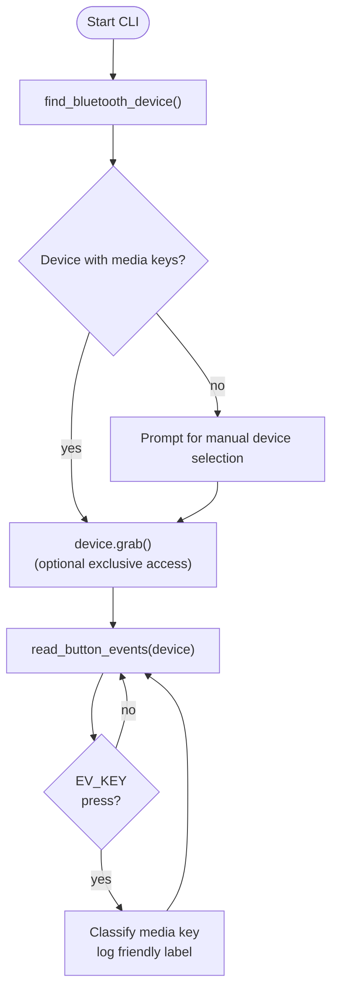

# `earbud_input.py` Reference

## Overview

`earbud_input.py` scans Linux input devices (via `evdev`) to locate a Bluetooth headset and stream its button events. The script is designed for Raspberry Pi deployments where headphone buttons trigger downstream OCR or TTS actions.

## Runtime Flow

## Key Functions

| Function                     | Responsibility                                                                                                | External Dependencies                                     |
| ---------------------------- | ------------------------------------------------------------------------------------------------------------- | --------------------------------------------------------- |
| `find_bluetooth_device()`    | Enumerates `/dev/input` devices, returning the first with media-key capabilities.                             | `evdev.InputDevice`, `evdev.list_devices`, `evdev.ecodes` |
| `read_button_events(device)` | Consumes the device event loop, printing symbolic names for recognised keycodes.                              | `evdev.categorize`                                        |
| `main()`                     | Orchestrates device discovery, optional manual selection, grabs exclusive access, and enters the reader loop. | `sys.argv` for script name                                |

## Interactions

- The script is standalone but can be combined with `ocr_client.py` or other automation by piping its stdout or by modifying `read_button_events` to trigger actions.
- Requires the `evdev` kernel module and Python package.

## Implementation Notes

- Button codes map to media controls (play/pause, next, previous, volume). Unknown codes are printed for debugging, easing custom mappings.
- `device.grab()` prevents other processes from receiving events; comment out when cooperative sharing is needed.
- `KeyboardInterrupt` is handled to terminate cleanly; `PermissionError` hints to rerun with `sudo`.

## Extensibility Ideas

- Replace the `print` statements with callbacks to enqueue OCR jobs (see `queue.put` in `mp_queue.py`).
- Extend the key mapping table to emit HTTP requests toward `bbocr_server/server.py` for remote control.
