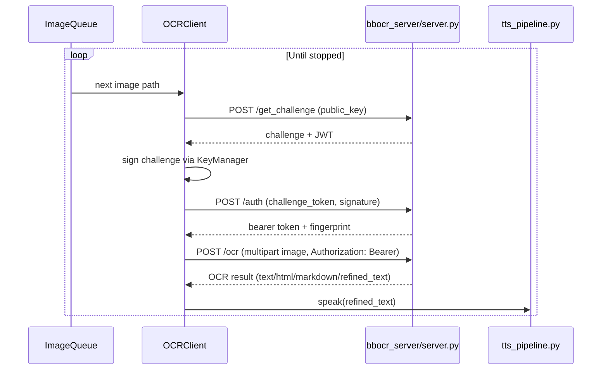

# `ocr_client.py` Reference

## Overview

The OCR client runs on embedded devices (e.g., Raspberry Pi) to capture image paths from a queue, authenticate with the remote OCR server, upload images, and forward Gemini-refined text to the text-to-speech pipeline. It is designed to be resilient against intermittent connectivity and supports both POSIX message queues and filesystem-backed queues.

## High-Level Flow

## Core Components

| Component          | Role                                                                                                                     | Interactions                                                                    |
| ------------------ | ------------------------------------------------------------------------------------------------------------------------ | ------------------------------------------------------------------------------- |
| `Config` dataclass | Centralises environment/CLI configuration for server URLs, key paths, queue backend selection, logging, and TTS options. | Values hydrate `KeyManager`, `ImageQueue`, and `TTSSink`.                       |
| `KeyManager`       | Generates or loads device RSA keys and signs server challenges; caches the server public key.                            | Uses `cryptography` primitives; cross-checks with `keys/` directory.            |
| `ImageQueue`       | Chooses between `_PosixQueueBackend` and `_DirectoryQueueBackend` to exchange image paths with capture scripts.          | `_PosixQueueBackend` depends on `posix_ipc`; fallback uses filesystem polling.  |
| `TTSSink`          | Launches `tts_pipeline.py` on demand and streams Gemini-refined text via stdin. Prefixes each line with `<image_stem>|` so audio is saved as MP3. | Spawns subprocesses and recovers from broken pipes.                             |
| `OCRClient`        | Orchestrates queue consumption, authentication, upload, and response handling.                                           | Uses `requests.Session` for HTTP, `KeyManager` for crypto, `TTSSink` for audio. |

## Detailed Workflow

1. **Configuration**: `parse_args` merges CLI overrides into `Config`; logging is initialised with `configure_logging`.
2. **Queue Consumption**: `OCRClient.run` loops on `ImageQueue.get`, recovering from IO errors with a configurable retry delay.
3. **Authentication**:
   - `ensure_authenticated` posts the device public key to `/get_challenge`.
   - Signs the returned challenge via `KeyManager.sign_challenge`.
   - Posts signature to `/auth`, storing the bearer `token`, expiry, and key fingerprint.
4. **Processing**:
   - `_process_image` resolves the path, builds a multipart request, and posts to `/ocr`.
   - Validates JSON response, logs errors, and triggers `TTSSink.speak` when `refined_text` is present (logs a warning otherwise). TTS now emits `<image_stem>.mp3` files.
5. **Lifecycle**: Signal handlers (SIGINT/SIGTERM) set `_stopped` to exit gracefully; `close` releases queue, TTS, and HTTP resources.

## Function Summary

| Function/Method                    | Description                                                                     |
| ---------------------------------- | ------------------------------------------------------------------------------- |
| `configure_logging(level)`         | Configures structured logging for the client.                                   |
| `ImageQueue.put/get/close`         | Abstract queue operations across POSIX and directory backends.                  |
| `TTSSink.speak(text, output_name)` | Lazily spawns `tts_pipeline.py`, streams Gemini-refined text (with optional MP3 filename), and handles restarts on failure. |
| `OCRClient.ensure_authenticated()` | Maintains a valid bearer token using challenge-response auth.                   |
| `OCRClient._process_image(path)`   | Handles upload, response parsing, TTS output, and cleanup.                      |

## File Interactions

- **Server**: Communicates with `bbocr_server/server.py` endpoints (`/get_challenge`, `/auth`, `/ocr`).
- **TTS**: Invokes `tts_pipeline.py` via `TTSSink`.
- **Queue**: Works with producers such as `take_image.py` or external scripts that place `.msg` files in the queue directory.
- **Keys**: Uses PEM files generated in `keys/` (shared with `bbocr_server/authorized_keys` via fingerprint matching).

## CLI Usage

| Option                       | Effect                                                                               |
| ---------------------------- | ------------------------------------------------------------------------------------ |
| `--enqueue IMAGE_PATH`       | Push a single file into the queue and exit (unless combined with `--process-image`). |
| `--process-image IMAGE_PATH` | Bypass queue consumption and process a specific image immediately.                   |
| `--server-url URL`           | Override the base HTTP URL for the OCR server.                                       |
| `--no-tts`                   | Disable audio playback (logging only).                                               |
| `--log-level LEVEL`          | Adjust logging verbosity.                                                            |

## Operational Tips

- Ensure time synchronisation so JWT expiries are accurate; drift may cause authentication failures.
- When using the filesystem queue, ensure the directory is shared across producers and the client (`OCR_QUEUE_DIR`).
- The client caches the server public key on first authentication (`OCR_SERVER_KEY_NAME`) so future runs can verify TLS alternatives if desired.
- If audio stays silent, confirm the server response includes `refined_text`; Gemini failures leave TTS disabled for that sample.
- MP3 files are written to the working directory (or `TTS_OUTPUT_DIR` if set) using the image stem (`img03.mp3`, etc.); ensure that location is writable.
- Configure MMS-TTS via env vars (e.g., `MMS_TTS_MODEL_ID`, `MMS_TTS_DEVICE`, `MMS_TTS_SPEAKER`, `TTS_OUTPUT_DIR`) before launching the OCR client so the TTS subprocess can synthesise audio.
