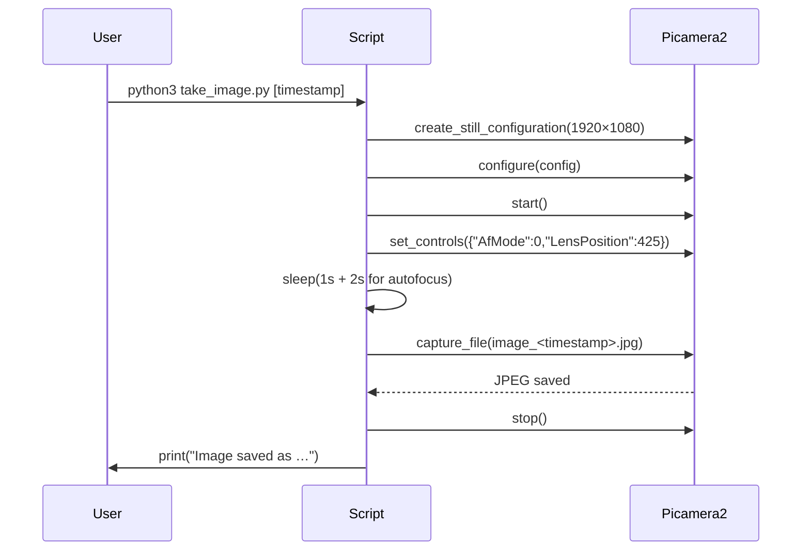

# `take_image.py` Reference

## Overview

This script captures a still frame from the Raspberry Pi Camera (libcamera-based `Picamera2`) and stores it with a timestamped filename. It is typically invoked by button handlers or cron jobs that feed the OCR queue.

## Workflow

## Parameters & Behavior

- Timestamp argument: `sys.argv[1]` overrides the default `time.strftime("%Y%m%d_%H%M%S")`.
- Autofocus: manual controls set `AfMode` and `LensPosition` prior to capture to avoid blurred frames.
- Resolution: `1920×1080` stills are requested; adjust inside `create_still_configuration` if needed.

## Error Handling

- Any exceptions during configuration or capture are caught, logged via `print`, and the script exits with status `1`.

## Interactions

- Generated images can be enqueued to the OCR pipeline via `ocr_client.enqueue_image` or moved into the filesystem queue consumed by `ocr_client.ImageQueue`.
- The script shares no global state but relies on the Picamera2 stack installed on the OS.

## Extension Tips

| Enhancement          | Description                                                                                  |
| -------------------- | -------------------------------------------------------------------------------------------- |
| Integrate queue push | After successful capture, call `ocr_client.enqueue_image` to streamline capture-to-OCR flow. |
| Add LED feedback     | Toggle a GPIO LED before/after capture so users receive tactile feedback.                    |
| Exposure control     | Use `set_controls` to adjust `ExposureTime` or `AnalogueGain` for low-light conditions.      |
