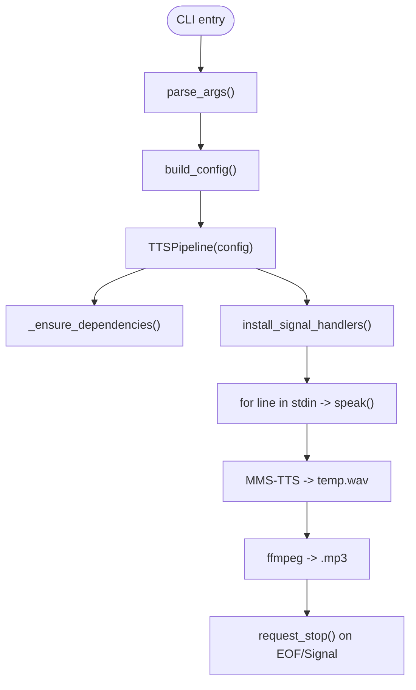

# `tts_pipeline.py` Reference

## Overview

`tts_pipeline.py` implements a streaming text-to-speech service designed for lightweight devices. It consumes newline-delimited, Gemini-refined text from stdin, synthesises audio with Meta's MMS-TTS (VITS) models, and writes each utterance to an MP3 file (named `<basename>.mp3`) under `TTS_OUTPUT_DIR` (defaults to the process working directory).

## Architecture

## Key Classes

| Component     | Description                                                                                                      | Interactions                                        |
| ------------- | ---------------------------------------------------------------------------------------------------------------- | --------------------------------------------------- |
| `TTSConfig`   | Captures MMS-TTS model id, torch device/dtype, optional speaker controls, ffmpeg command, and output directory. | Populated from environment variables/CLI overrides. |
| `TTSPipeline` | Validates dependencies, streams text to MMS-TTS via Transformers, converts WAV output to MP3, and logs results.  | Used by `main`; its `speak` method is invoked per line. |

## Synthesis Flow

1. Incoming text lines may be prefixed with `<basename>|`. The basename determines the MP3 filename; otherwise an automatic timestamp is used.
2. The configured MMS-TTS model (default `facebook/mms-tts-ben`) renders the utterance to a temporary WAV file using PyTorch.
3. `ffmpeg` converts the WAV to MP3 under `TTS_OUTPUT_DIR`.
4. Temporary files are deleted after conversion; the MP3 path is logged.

## Signal Behavior

- Installs SIGINT/SIGTERM handlers that set `_stop_requested`; `run_stream` respects the flag to exit cleanly.

## Error Reporting

- Missing dependencies raise `RuntimeError` (caught in `main` for user-friendly logging).
- Failures during synthesis/conversion are logged and the pipeline continues with subsequent lines.

## Integration Points

- `ocr_client.py` launches this pipeline via `TTSSink`, writing Gemini-refined text to its stdin. Lines include `<image_stem>|text` so the pipeline saves audio as `<image_stem>.mp3`.
- Environment variables (`MMS_TTS_MODEL_ID`, `MMS_TTS_DEVICE`, `MMS_TTS_DTYPE`, `MMS_TTS_SPEAKER`, `TTS_OUTPUT_DIR`, etc.) allow runtime tuning without code changes.

## Usage Examples

| Command                                            | Result                                                             |
| -------------------------------------------------- | ------------------------------------------------------------------ |
| `python3 tts_pipeline.py --speak "হ্যালো বিশ্ব"` | Generates a temporary MP3 (`cli_sample.mp3`) for the supplied text |
| `echo "img03|পরীক্ষা" \| python3 tts_pipeline.py` | Creates `img03.mp3` in the current (or configured) output folder. |
