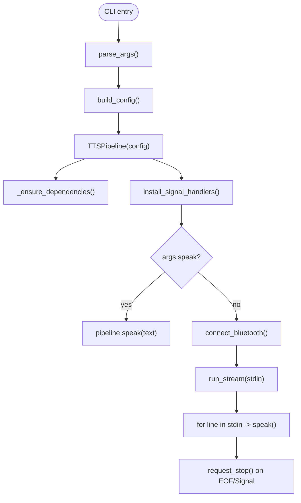

# `tts_pipeline.py` Reference

## Overview

`tts_pipeline.py` implements a streaming text-to-speech service designed for Raspberry Pi deployments. It reads newline-delimited text from stdin, optionally connects to a Bluetooth headset, and renders speech using `espeak-ng` (or `espeak` fallback), optionally piping audio through ALSA (`aplay`).

## Architecture

## Key Classes

| Component     | Description                                                                                                                           | Interactions                                                  |
| ------------- | ------------------------------------------------------------------------------------------------------------------------------------- | ------------------------------------------------------------- |
| `TTSConfig`   | Dataclass capturing voice, rate, volume, command paths, Bluetooth targets, and logging level.                                         | Populated from environment variables and CLI overrides.       |
| `TTSPipeline` | Core engine handling dependency validation, Bluetooth auto-connect, speaking text either directly or via ALSA, and graceful shutdown. | Used by `main`; its `speak` method is callable independently. |

## Speaking Modes

- **Direct (`_speak_direct`)**: Runs `espeak-ng --stdin`, letting the tool send audio directly to the default sink.
- **ALSA (`_speak_via_aplay`)**: Pipes `espeak-ng --stdout` into `aplay -D <device>` when `audio_device` is provided.

## Bluetooth Handling

- Configured MAC address triggers `bluetoothctl connect <MAC>` retries until successful or attempts are exhausted.
- Connection status is checked via `bluetoothctl info`.

## Signal Behavior

- Installs SIGINT/SIGTERM handlers that set `_stop_requested`; `run_stream` respects the flag to exit cleanly.

## Error Reporting

- Missing dependencies raise `RuntimeError` (caught in `main` for user-friendly logging).
- Subprocess failures log stderr and continue so that one failed utterance does not terminate the pipeline.

## Integration Points

- `ocr_client.py` launches this pipeline via `TTSSink`, writing recognised text to its stdin.
- Environment variables (`TTS_*`) allow runtime tuning without code changes.

## Usage Examples

| Command                                                                         | Result                                                                 |
| ------------------------------------------------------------------------------- | ---------------------------------------------------------------------- |
| `python3 tts_pipeline.py --speak "হ্যালো বিশ্ব"`                                | Speak the supplied text once and exit.                                 |
| `echo "queued text" \| python3 tts_pipeline.py --audio-device bluealsa:DEV=...` | Consume stdin and route audio through a Bluetooth device via bluealsa. |
